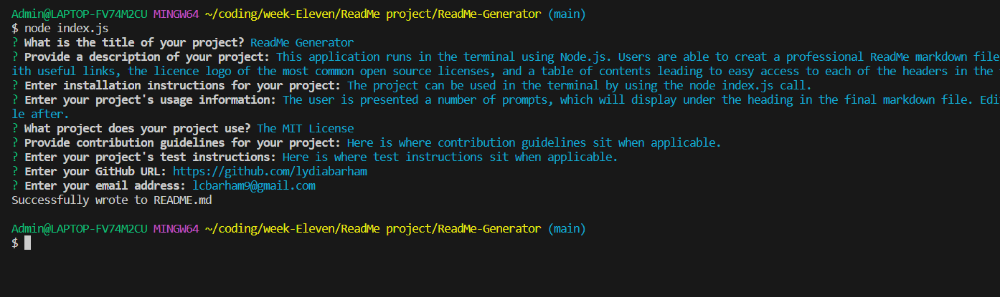

# ReadMe Generator
  
## Description
This application runs in the terminal using Node.js. Users are able to creat a professional ReadMe markdown file in the correct order, with useful links, the licence logo of the most common open source licenses, and a table of contents leading to easy access to each of the headers in the file.

## Table of Contents

- [Installation](#installation)
- [Usage](#usage)
- [License](#license)
- [Contributing](#contributing)
- [Tests](#tests)
- [Questions](#questions)

## Installation
The project can be used in the terminal by using the "node index.js" call.

## Usage
The user is presented a number of prompts, which will display under the heading in the final markdown file. Edits can be made to the file after.

Here is a link to a walk through video demonstrating how to use the application: https://drive.google.com/file/d/14-vDtQZILTt-AqTguRzilDxIr2XvJi5d/view?usp=sharingLinks to an external site.

## License
This application is covered by: no license

## Contributing
Here is where contribution guidelines sit when applicable.

## Tests
Here is where test instructions sit when applicable.

## Questions
GitHub username: [https://github.com/lydiabarham](https://github.com/lydiabarham)

Email: [lcbarham9@gmail.com](mailto:lcbarham9@gmail.com?subject=Questions)

  
